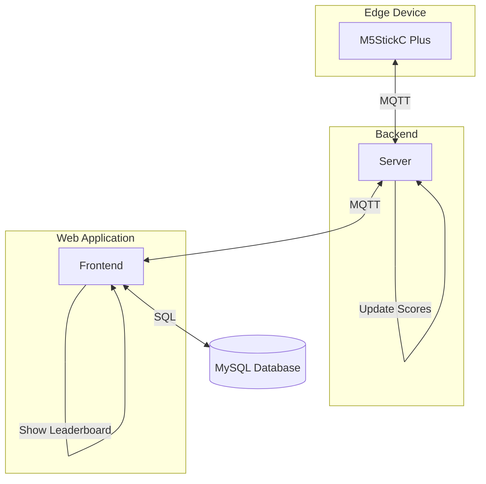
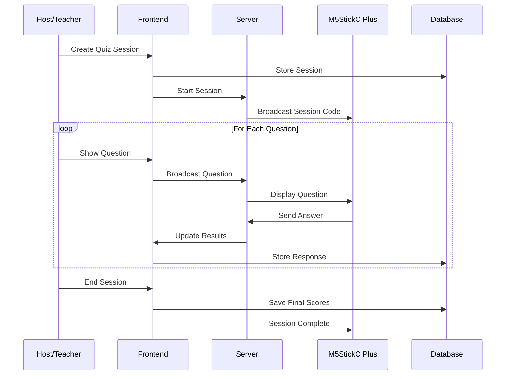
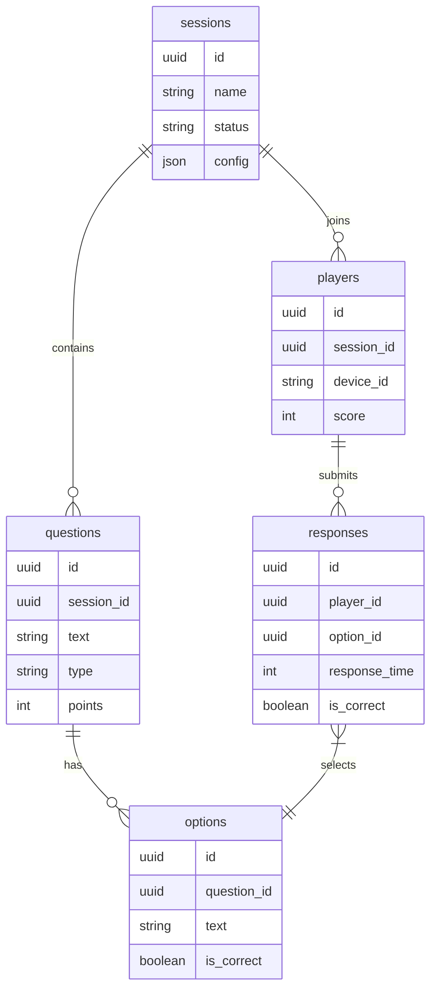

# IoT Quiz System

A real-time interactive quiz system powered by M5StickC Plus devices and Next.js. Perfect for classrooms, events, and interactive learning sessions.

## 🌟 Features

- **Live Interactive Quizzes**

  - Real-time question display
  - Instant response collection
  - Live score updates
  - Dynamic leaderboard

- **M5StickC Plus Integration**

  - Hardware-based answer submission
  - Low-latency response time
  - Battery-efficient operation
  - Easy device pairing

- **Rich Quiz Management**
  - Multiple choice questions
  - True/False questions
  - Configurable time limits
  - Point-based scoring system
  - Session management

## 🏗️ Architecture

### System Overview



### Quiz Session Flow



### Database Schema Relationships



### 1. Frontend (Next.js)

- Modern web interface built with Next.js
- Real-time updates using MQTT
- Responsive design with Tailwind CSS
- Beautiful UI components from shadcn/ui
- MySQL database with Drizzle ORM

### 2. Server (MQTT Broker)

- Handles real-time communication
- Manages quiz sessions
- Processes responses
- Calculates scores
- Ensures low-latency operation

### 3. Edge Device (M5StickC Plus)

- Compact IoT device for answer input
- Quick response buttons
- Display for feedback
- Battery-powered operation
- WiFi connectivity

## 🚀 Getting Started

### Prerequisites

- Node.js 18+
- pnpm
- MySQL 8.0+
- M5StickC Plus device(s)
- Arduino IDE with M5StickC Plus support

### Installation

1. **Clone the repository**

   ```bash
   git clone https://github.com/jiaweing/IoT-Quiz
   cd IoT-Quiz
   ```

2. **Install dependencies**

   ```bash
   # Frontend
   cd frontend
   pnpm install

   # Server
   cd ../server
   pnpm install
   ```

3. **Configure environment variables**

   ```bash
   # Frontend (.env)
   cp frontend/.env.example frontend/.env
   # Edit the .env file with your configuration
   ```

4. **Setup database**

   ```bash
   cd frontend
   pnpm db:generate   # Generate migrations
   pnpm db:push      # Push to database
   ```

5. **Flash M5StickC Plus**
   - Open `edge/edge.ino` in Arduino IDE
   - Configure WiFi credentials
   - Upload to device

## 🎮 Usage

1. **Start the server**

   ```bash
   cd server
   pnpm start
   ```

2. **Start the frontend**

   ```bash
   cd frontend
   pnpm dev
   ```

3. **Access the application**

   - Open `http://localhost:3000` in your browser
   - Create a new quiz session
   - Share the session code with participants

4. **Using M5StickC Plus**
   - Power on the device
   - Wait for WiFi connection
   - Enter the session code
   - Start answering questions!

## 💻 Development

### Project Structure

```
IoT/
├── frontend/           # Next.js frontend application
│   ├── app/           # Pages and routing
│   ├── components/    # React components
│   ├── db/           # Database schema and migrations
│   ├── hooks/        # Custom React hooks
│   └── public/       # Static assets
├── server/           # MQTT broker and quiz logic
│   └── src/         # Server source code
└── edge/            # M5StickC Plus code
    └── edge.ino     # Arduino sketch
```

### Database Schema

The system uses a MySQL database with the following structure:

- `sessions`: Quiz session management
- `questions`: Quiz questions and configuration
- `options`: Answer options for questions
- `players`: Participant tracking
- `responses`: User responses and scoring

### Adding New Features

1. Create a feature branch
2. Implement your changes
3. Add tests if applicable
4. Submit a pull request
5. Update documentation

## 📝 Contributing

Contributions are welcome! Please read our contributing guidelines for details on our code of conduct and the process for submitting pull requests.

## 📜 License

This project is licensed under the MIT License - see the [LICENSE](LICENSE) file for details.

## 🙏 Acknowledgments

- [Next.js](https://nextjs.org/) for the frontend framework
- [shadcn/ui](https://ui.shadcn.com/) for beautiful UI components
- [MQTT.js](https://github.com/mqttjs/MQTT.js) for real-time communication
- [M5Stack](https://m5stack.com/) for the M5StickC Plus hardware
- [Drizzle ORM](https://orm.drizzle.team/) for database management
